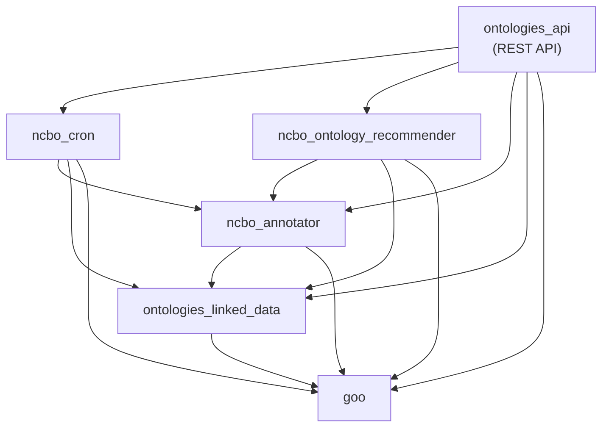

# BioPortal REST API repository dependencies

Arrows point from each repository to its direct dependency.

```mermaid
flowchart TB
    API["ontologies_api<br/>(REST API)"]
    CRON["ncbo_cron"]
    REC["ncbo_ontology_recommender"]
    ANN["ncbo_annotator"]
    OLD["ontologies_linked_data"]
    GOO["goo"]

    API --> CRON
    API --> REC
    API --> ANN
    API --> OLD
    API --> GOO

    CRON --> ANN
    CRON --> OLD
    CRON --> GOO

    REC --> ANN
    REC --> OLD
    REC --> GOO

    ANN --> OLD
    ANN --> GOO

    OLD --> GOO
```

`goo` is the foundation; `ontologies_api` directly includes all five supporting gems.
